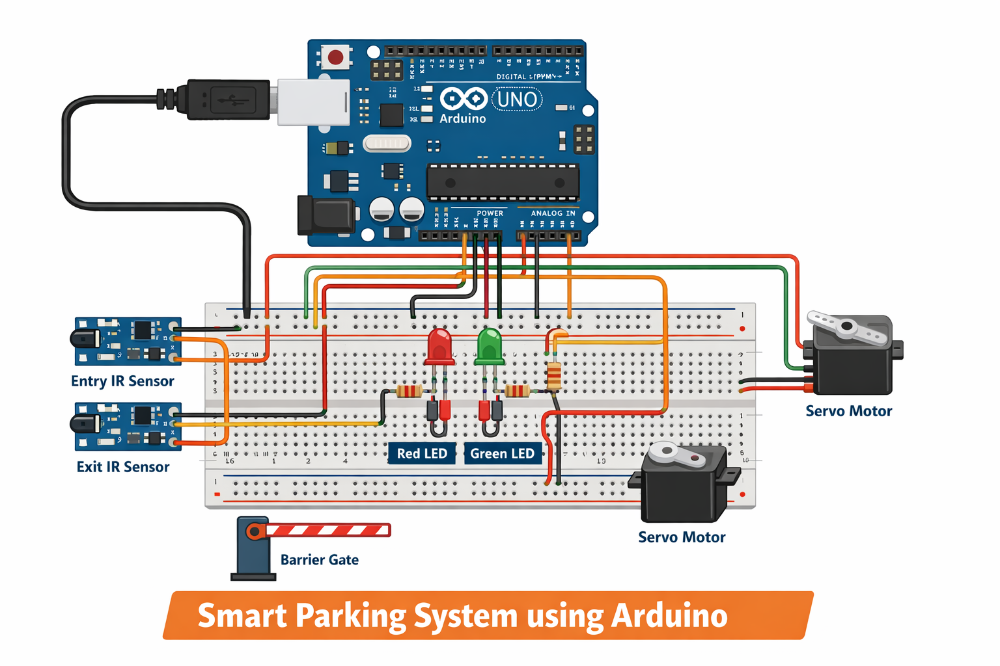

# 🚗 Smart Parking System using Arduino

## 📌 Project Overview
The Smart Parking System is an IoT-based project built using Arduino, IR sensors, and a servo motor to automate vehicle parking management.  
It detects vehicles at entry and exit points and controls a gate automatically, improving efficiency and reducing manual effort.

---

## 🖼️ Project Images

### 🔧 Circuit Diagram

### 🛠️ Hardware Setup

### 🔌 Arduino Connection (Without Breadboard)

### 🚗 Working Model

---

## ⚙️ Features
- Automatic vehicle detection using IR sensors  
- Servo motor-based gate control  
- Entry and exit tracking system  
- Efficient parking space monitoring  
- Low-cost and easy-to-build design  

---

## 🛠️ Components Used
- Arduino Uno  
- IR Sensors (2)  
- Servo Motor  
- LEDs  
- Jumper Wires  
- Power Supply  

---

## 🔌 Working Principle
1. IR sensors detect vehicles at entry and exit  
2. Arduino processes the sensor signals  
3. Servo motor opens the gate when a vehicle is detected  
4. After entry/exit, the gate closes automatically  
5. The system keeps track of parking availability  

---

## 💻 Arduino Code
The complete code is available in:  
`code/smart_parking.ino`

---

## 📂 Project Files
- 📄 Project Report → `docs/IOT_project.pdf`  
- 💻 Arduino Code → `code/smart_parking.ino`  
- 🖼️ Images → `images/`  

---

## 🚀 How to Run
1. Connect components as per circuit diagram  
2. Upload the code using Arduino IDE  
3. Power the Arduino board  
4. Test using an object/vehicle  

---

## 📊 Advantages
- Reduces manual parking management  
- Saves time and effort  
- Cost-effective solution  
- Easy implementation  

---

## 🔮 Future Scope
- Integration with IoT (mobile app control)  
- Cloud-based monitoring system  
- LCD display for slot availability  
- Smart city applications  

---

## 👨‍💻 Team Members
- M. Varun Tej Reddy  
- M. Rohan  
- M. Yashwanth  
- Md. Ibrahim  

---

## ⭐ Support
If you like this project, please give it a ⭐ on GitHub!
